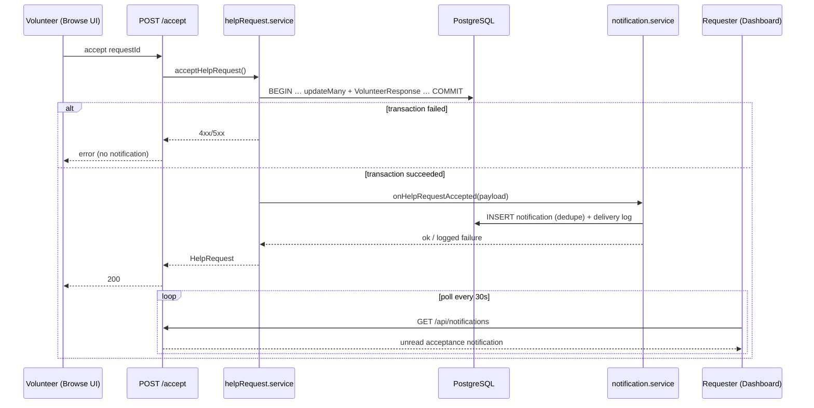

# Help Request Acceptance Notification — System Design

**Ticket:** HELPER-69  
**Parent:** Requester acceptance notification story (HELPER-69–73)  
**Depends on:** `help-request-volunteer-response.md` (HELPER-56 accept flow), `HelpRequest-system-design.md`  
**Implements later:** HELPER-70 (UI), HELPER-71 (emit + enqueue), HELPER-72 (delivery + dedup), HELPER-73 (logging + retry)

**User story:** As a requester, I want to know when a volunteer accepts my request.

---

## 1. Purpose

Define how the platform notifies a **requester** when an approved volunteer **successfully accepts** their open help request:

- What event triggers a notification.
- Which channel(s) are used in MVP.
- What data is included (and what is withheld for privacy).
- How duplicate or invalid events are prevented.
- How delivery attempts are logged for troubleshooting.

This document is the source of truth for schema, API, and UI behavior. Implementation tickets must not change these invariants without updating this file.

---

## 2. Goals / non-goals

### In scope

| ID | Requirement |
|----|-------------|
| G1 | Requester receives an in-app notification when their request transitions to `ACCEPTED` via a valid accept. |
| G2 | Notification includes request summary, volunteer display name, and acceptance timestamp. |
| G3 | Notifications are created only for successful accept transactions (not decline, not failed/raced accept). |
| G4 | At most one acceptance notification per request (deduplication). |
| G5 | Each delivery attempt is logged with outcome (`DELIVERED`, `FAILED`, `SKIPPED`). |
| G6 | Requester can list notifications and mark them read. |

### Out of scope

| Item | Owner |
|------|--------|
| Email or push delivery | future (channel enum reserved) |
| Notify on decline, cancel, complete, withdraw | future stories |
| Real-time WebSocket delivery | future; MVP uses polling |
| Notification preferences / opt-out | future |
| Admin notification views | future |
| Chat message notifications | `chat.md` (separate epic) |

---

## 3. Terminology

| Term | Definition |
|------|------------|
| **Valid acceptance** | `POST /api/requests/:id/accept` returns 200 after the accept transaction commits: `HelpRequest.status = ACCEPTED`, `volunteerId` set, `VolunteerResponse` row with `action = ACCEPTED`. |
| **Invalid acceptance** | Any 4xx/5xx on accept, or accept that loses the concurrency race (`updateMany` count ≠ 1). No notification. |
| **Notification** | Persistent in-app row targeted at the requester (`recipientId`). |
| **Delivery** | One attempt to make a notification available on a channel (MVP: `IN_APP` only). |
| **Dedupe key** | Stable unique string per logical event; prevents duplicate notifications for the same accept. |

---

## 4. MVP channel decision

| Channel | MVP | Rationale |
|---------|-----|-----------|
| **In-app** | **Yes** | Matches chat MVP pattern (polling, no external provider). Requester already uses `RequesterDashboard`. |
| **Email** | **Phase 2 (HELPER-144)** | SendGrid or `log` mode; second `NotificationDelivery` row on same notification. |
| **Push** | No | No WebSocket/push stack. |

**MVP delivery model:** write `Notification` + `NotificationDelivery` rows in the database. “Delivered” means the row is readable via `GET /api/notifications`. The requester UI polls this endpoint while the dashboard is open.

---

## 5. Trigger

### 5.1 Event

| Field | Value |
|-------|--------|
| Event name | `help_request.accepted` |
| Emitter | `acceptHelpRequest()` in `helpRequest.service.js` |
| When | **After** the accept transaction commits successfully (not inside the assignment transaction). |
| Recipient | `HelpRequest.requesterId` |

### 5.2 Valid vs invalid

| Scenario | Notification? |
|----------|---------------|
| Accept returns 200, DB shows `ACCEPTED` + `VolunteerResponse ACCEPTED` | **Yes** |
| Accept returns 409 (already assigned, race lost, duplicate response) | No |
| Accept returns 403/404/400 | No |
| Decline | No |
| Request created, edited, cancelled | No |

**Invariant N1:** A notification is created if and only if the accept HTTP handler returns 200 with `data.status === 'ACCEPTED'`.

**Invariant N2:** `acceptedAt` on the notification payload equals `VolunteerResponse.createdAt` for `(requestId, volunteerId)` from the same accept.

### 5.3 Flow



Accept must **not** roll back if notification creation fails. Notification failure is logged and retried (§10).

---

## 6. Payload and privacy

### 6.1 Notification payload (JSON)

Stored on `Notification.payload` and returned by the API:

```json
{
  "type": "HELP_REQUEST_ACCEPTED",
  "requestId": 42,
  "requestTitle": "Need help picking up groceries",
  "requestCategory": "GROCERY",
  "requestUrgency": "MEDIUM",
  "volunteerId": 5,
  "volunteerName": "Emma Garcia",
  "acceptedAt": "2026-08-28T14:32:01.123Z"
}
```

| Field | Source | Notes |
|-------|--------|-------|
| `requestId` | `HelpRequest.id` | Deep link to dashboard card |
| `requestTitle` | `HelpRequest.title` | Shown in alert/inbox |
| `requestCategory` | `HelpRequest.category` | Optional chip in UI |
| `requestUrgency` | `HelpRequest.urgency` | Optional chip in UI |
| `volunteerId` | `HelpRequest.volunteerId` | For dashboard volunteer section |
| `volunteerName` | `User.name` via volunteer profile | Display name only |
| `acceptedAt` | `VolunteerResponse.createdAt` | ISO 8601 UTC |

### 6.2 Privacy constraints

| Data | In notification payload? | Rationale |
|------|---------------------------|-----------|
| Volunteer email | **No** | Requester sees contact info on expanded dashboard card only |
| Volunteer phone | **No** | Same |
| Request address / lat-lng | **No** | Requester already owns the request; not needed in alert |
| Other volunteers who declined | **No** | Irrelevant to requester |

Volunteer PII beyond display name stays on `GET /api/requests/mine` (enriched) when the requester opens the request detail.

---

## 7. Data model

### 7.1 Enums

```prisma
enum NotificationType {
  HELP_REQUEST_ACCEPTED
}

enum NotificationChannel {
  IN_APP
  EMAIL // reserved, not used in MVP
}

enum NotificationDeliveryStatus {
  PENDING
  DELIVERED
  FAILED
  SKIPPED
}
```

### 7.2 Tables

```prisma
model Notification {
  id          Int              @id @default(autoincrement())
  recipientId Int              @map("recipient_id")
  type        NotificationType
  dedupeKey   String           @unique @map("dedupe_key") @db.VarChar(120)
  payload     Json
  readAt      DateTime?        @map("read_at")
  createdAt   DateTime         @default(now()) @map("created_at")

  recipient  User                   @relation(fields: [recipientId], references: [id], onDelete: Cascade)
  deliveries NotificationDelivery[]

  @@index([recipientId, createdAt(sort: Desc)])
  @@index([recipientId, readAt])
  @@map("notifications")
}

model NotificationDelivery {
  id             Int                        @id @default(autoincrement())
  notificationId Int                        @map("notification_id")
  channel        NotificationChannel
  status         NotificationDeliveryStatus @default(PENDING)
  attemptCount   Int                        @default(0) @map("attempt_count")
  lastAttemptAt  DateTime?                  @map("last_attempt_at")
  deliveredAt    DateTime?                  @map("delivered_at")
  failureReason  String?                    @map("failure_reason") @db.VarChar(500)
  createdAt      DateTime                   @default(now()) @map("created_at")

  notification Notification @relation(fields: [notificationId], references: [id], onDelete: Cascade)

  @@unique([notificationId, channel])
  @@index([status, lastAttemptAt])
  @@map("notification_deliveries")
}
```

Add `User.notifications Notification[]`.

### 7.3 Dedupe key

```text
help_request_accepted:{requestId}
```

**Invariant N3:** `dedupeKey` is unique. A second insert for the same request (retry, double hook, bug) must not create a second notification — catch `P2002`, log `SKIPPED` delivery row or no-op.

### 7.4 Source of truth

| Question | Read from |
|----------|-----------|
| Was requester notified? | `Notification` where `dedupeKey = help_request_accepted:{id}` |
| Did in-app delivery succeed? | `NotificationDelivery` where `channel = IN_APP` and `status = DELIVERED` |
| When was it accepted? | `payload.acceptedAt` (mirrors `VolunteerResponse.createdAt`) |
| Has requester seen it? | `Notification.readAt IS NOT NULL` |

---

## 8. HTTP API

All routes require `jwtMiddleware`. Requester (or admin) only for their own notifications.

### 8.1 List notifications

```http
GET /api/notifications?page=1&pageSize=20&unreadOnly=false
```

**Auth:** `requireRole('REQUESTER')` — recipient must be `req.user.id`.

**Response 200:**

```json
{
  "success": true,
  "data": [
    {
      "id": 1,
      "type": "HELP_REQUEST_ACCEPTED",
      "payload": { "...": "..." },
      "readAt": null,
      "createdAt": "2026-08-28T14:32:01.500Z"
    }
  ],
  "meta": { "page": 1, "pageSize": 20, "total": 1, "totalPages": 1, "unreadCount": 1 }
}
```

Default sort: `createdAt desc`.

### 8.2 Mark read

```http
PATCH /api/notifications/:id/read
```

**Auth:** recipient must own the notification → else 404.

**Response 200:** `{ "success": true, "data": { "id": 1, "readAt": "..." } }`

### 8.3 Mark all read (optional HELPER-70)

```http
PATCH /api/notifications/read-all
```

Sets `readAt` on all unread for `req.user.id`. Can be deferred if UI only marks per-item.

---

## 9. Service design

### 9.1 `notification.service.js`

```text
onHelpRequestAccepted({ requestId, requesterId, volunteerId, acceptedAt })
  → build payload (load request + volunteer name)
  → createNotificationWithDelivery({ dedupeKey, recipientId, type, payload, channel: IN_APP })
```

Called from `acceptHelpRequest()` **after** the accept transaction returns.

### 9.2 Create + deliver (MVP in-app)

```text
createNotificationWithDelivery(...)
  TRY
    notification = INSERT Notification (dedupeKey unique)
    delivery = INSERT NotificationDelivery { channel: IN_APP, status: PENDING }
    UPDATE delivery SET status = DELIVERED, deliveredAt = now(), attemptCount = 1
    RETURN notification
  CATCH P2002 on dedupeKey
    LOG dedupe skip
    INSERT or UPDATE delivery row status = SKIPPED
  CATCH other
    INSERT delivery status = FAILED, failureReason = err.message
    THROW or return for retry worker
```

For MVP without a job queue, in-app “delivery” is synchronous: if the `Notification` row is inserted, delivery is `DELIVERED` in the same request.

### 9.3 Enrich `GET /api/requests/mine` (HELPER-70 dependency)

`RequesterDashboard` already renders `request.volunteer.*`. Extend `getHelpRequests` to `include` volunteer user name/email/phone when `status = ACCEPTED` so the dashboard card matches notification content.

---

## 10. Retry and failure handling (HELPER-73)

| Scenario | Behavior |
|----------|----------|
| DB error on `Notification` insert (not dedupe) | Log `FAILED` delivery; accept response still 200. Retry via background job or manual reprocessor. |
| Dedupe conflict (`P2002`) | `SKIPPED`; no user-visible duplicate. |
| Payload build fails (missing volunteer) | `FAILED` with reason; retry after data fix. |

**MVP retry strategy (no Redis/SQS):**

1. `NotificationDelivery` rows with `status = FAILED` and `attemptCount < 3`.
2. On server startup or a lightweight `setInterval` (60s) in dev, `notificationRetryService` re-attempts failed in-app deliveries.
3. Backoff: immediate, +30s, +120s (store `lastAttemptAt`).
4. After 3 failures, leave `FAILED`; log for ops.

**Logging (structured console for MVP):**

```json
{
  "event": "notification_delivery",
  "notificationId": 1,
  "channel": "IN_APP",
  "status": "DELIVERED",
  "dedupeKey": "help_request_accepted:42",
  "recipientId": 3,
  "attemptCount": 1
}
```

Production can forward these logs to a collector later.

---

## 11. UI design (HELPER-70)

### 11.1 Pattern

| Surface | MVP behavior |
|---------|----------------|
| **Dashboard banner** | Top of `RequesterDashboard`: MUI `Alert` (severity `success`) for unread `HELP_REQUEST_ACCEPTED` notifications. Dismiss → `PATCH .../read`. |
| **Inbox list** | Same page section or slide-down: chronological list with read/unread styling (`readAt === null` → bold / dot). |
| **Header badge** | Optional follow-up: bell + `unreadCount` from list meta. |

No email template in MVP.

### 11.2 Copy template

**Title:** `{volunteerName} accepted your request`

**Body:** `"{requestTitle}" — {formatted acceptedAt local time}`

**Action:** “View request” scrolls to / expands the matching card on the dashboard.

### 11.3 Polling

Match chat MVP: poll `GET /api/notifications?unreadOnly=true` every **30 seconds** while `RequesterDashboard` is mounted. Refetch on window focus.

### 11.4 Read/unread

| State | UI |
|-------|-----|
| Unread | Filled dot, `Alert` visible, `fontWeight: 600` on title |
| Read | No dot, alert dismissed, normal weight |

---

## 12. Ticket map

| Ticket | Scope |
|--------|--------|
| **HELPER-69** | This document |
| **HELPER-71** | Prisma migration, `notification.service`, hook in `acceptHelpRequest`, `GET/PATCH` routes |
| **HELPER-72** | Dedupe key enforcement, `P2002` handling, `SKIPPED` delivery rows |
| **HELPER-73** | Structured delivery logs, retry loop, `FAILED` persistence |
| **HELPER-70** | `RequesterDashboard` alert/inbox, polling hook, mark-read UX; enrich `/mine` volunteer join |

**Suggested implementation order:** 69 → 71 → 72 → 73 → 70 (UI last so API is stable; 70 can start in parallel once `GET /api/notifications` exists).

---

## 13. Test matrix (acceptance criteria)

| ID | Test | Expected |
|----|------|----------|
| T1 | Valid accept | One `Notification` for requester; `dedupeKey` set; delivery `DELIVERED` |
| T2 | Payload | Contains title, volunteer name, `acceptedAt` |
| T3 | Decline | No notification |
| T4 | Losing race accept (409) | No notification |
| T5 | Duplicate hook / retry | Second insert `SKIPPED` or no-op; still one notification |
| T6 | `GET /api/notifications` | Requester sees own only; other user 403/empty |
| T7 | `PATCH read` | `readAt` set; unread count decreases |
| T8 | Accept succeeds, notify fails | Accept still 200; delivery `FAILED` logged |

---

## 14. Open questions (team)

1. **Withdraw after accept** — if a volunteer drops an assignment later, do we notify the requester again when it reopens? Out of scope until withdraw story is defined.
2. **Header bell** — MVP dashboard-only vs global nav badge?
3. **Email phase 2** — implemented in HELPER-144: same `Notification` row + `NotificationDelivery` with `channel = EMAIL`. See §16.

---

## 16. Email channel (HELPER-144)

### 16.1 Delivery model

Same trigger and dedupe key as in-app. One `Notification` row; two delivery rows:

| Channel | MVP behavior |
|---------|----------------|
| `IN_APP` | Unchanged (§4) |
| `EMAIL` | Sent to `User.email` for `recipientId` after in-app attempt |

Accept still returns 200 if email fails; `NotificationDelivery` for `EMAIL` records `FAILED` and retry applies (§10).

### 16.2 Environment

| Variable | Purpose |
|----------|---------|
| `EMAIL_DELIVERY_MODE` | `log` (dev default) or `sendgrid` |
| `EMAIL_FROM` | From address, e.g. `Neighborhood Helper <noreply@example.com>` |
| `SENDGRID_API_KEY` | Required when mode is `sendgrid` |
| `CLIENT_URL` | Dashboard link in email body |

### 16.3 Email content (privacy)

Same fields as in-app alert: volunteer display name, request title, acceptance time. No volunteer phone/email, no request address.

**Subject:** `{volunteerName} accepted your help request`

**Action link:** `{CLIENT_URL}/requester-dashboard`

### 16.4 Implementation

- `backend/src/services/emailDelivery.service.js` — template + SendGrid/log sender
- `notification.service.js` — `attemptEmailDelivery()` after `attemptInAppDelivery()`

---

## 15. References

- `docs/help-request-volunteer-response.md` — accept transaction, `VolunteerResponse.createdAt`
- `docs/chat.md` — polling precedent; push/email deferred
- `docs/HelpRequest-system-design.md` — requester ownership
- `frontend/src/pages/Requester/RequesterDashboard.jsx` — primary UI surface
