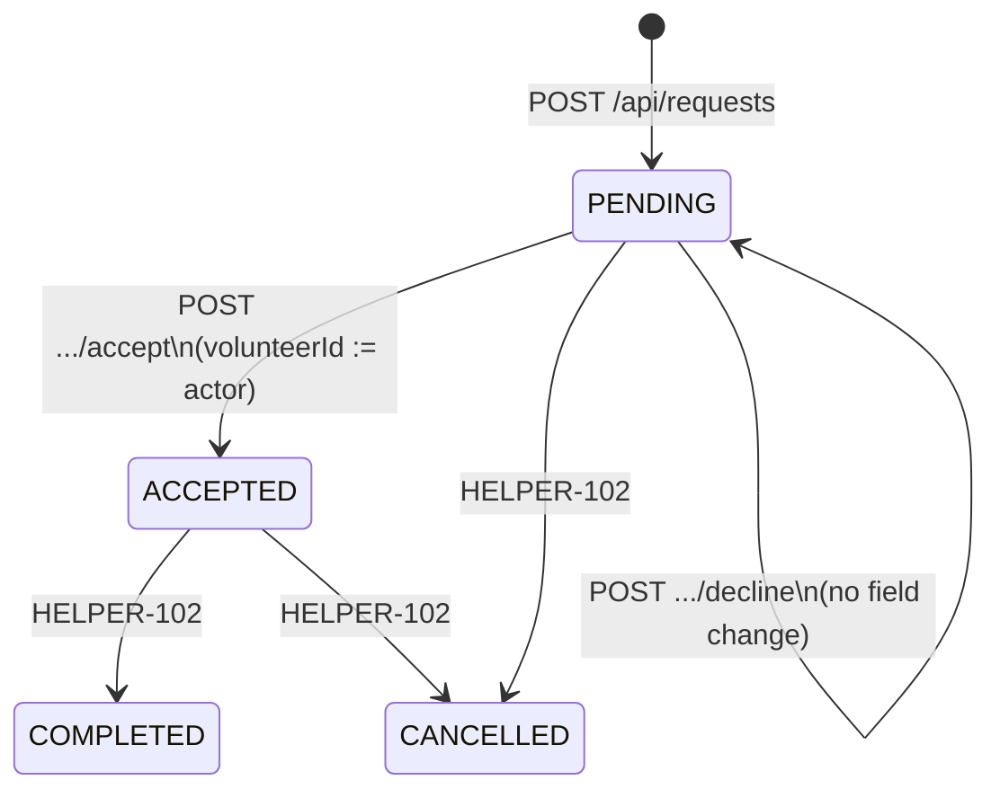

# Help Request Volunteer Response — System Design

**Ticket:** HELPER-64  
**Parent:** HELPER-56 (Accept or Decline Requests)  
**Depends on:** HelpRequest creation (`HelpRequest-system-design.md`), browse (`GET /api/requests`), volunteer approval (`Admin-system-design.md`)  
**Implements later:** HELPER-68 (schema), HELPER-66 (API), HELPER-67 (concurrency), HELPER-65 (UI)

**User story:** As a volunteer, I want to accept or decline requests so I can manage my availability.

---

## 1. Purpose

Define the assignment contract for a help request:

- When a request is **open** vs **assigned** vs **closed**.
- How a volunteer **accepts** (mutates assignment).
- How a volunteer **declines** (does **not** mutate assignment).
- How concurrent accepts are serialized to a single winner.
- How each volunteer action is persisted with a timestamp for audit.

This document is the source of truth for schema, HTTP API, and UI states. Implementation tickets must not change these invariants without updating this file.

---

## 2. Goals / non-goals

### In scope

| ID  | Requirement                                                                                            |
| --- | ------------------------------------------------------------------------------------------------------ |
| G1  | Approved volunteer can accept an open request.                                                         |
| G2  | Approved volunteer can decline an open request without changing `HelpRequest.status` or `volunteerId`. |
| G3  | Successful accept sets `status = ACCEPTED` and `volunteerId` to the actor.                             |
| G4  | A second accept on the same request fails; the first assignment is preserved.                          |
| G5  | Every accept/decline writes an audit row with `createdAt`.                                             |
| G6  | API returns explicit success and error payloads for the UI.                                            |

### Out of scope

| Item                                               | Owner                                          |
| -------------------------------------------------- | ---------------------------------------------- |
| Route handlers, Joi, tests                         | HELPER-66                                      |
| Transaction / `updateMany` implementation          | HELPER-67                                      |
| Prisma migrate                                     | HELPER-68                                      |
| Browse/detail buttons, toasts                      | HELPER-65                                      |
| Requester edit, cancel, complete                   | HELPER-102                                     |
| Chat thread creation                               | Chat design (`status = ACCEPTED` prerequisite) |
| Push/email notification                            | future                                         |
| Matching / ranking which requests a volunteer sees | browse + later matching                        |

---

## 3. Terminology

| Term                   | Definition                                                                                |
| ---------------------- | ----------------------------------------------------------------------------------------- |
| **Open request**       | `HelpRequest.status = PENDING` AND `HelpRequest.volunteerId IS NULL`                      |
| **Assigned request**   | `status = ACCEPTED` AND `volunteerId` is a non-null FK to `VolunteerProfile.userId`       |
| **Closed request**     | `status IN (COMPLETED, CANCELLED)`                                                        |
| **Volunteer response** | One row in `VolunteerResponse` for pair `(requestId, volunteerId)`                        |
| **Decline**            | Insert `VolunteerResponse.action = DECLINED`. Does **not** close or unassign the request. |
| **Accept**             | Atomic: assign request to actor + insert `VolunteerResponse.action = ACCEPTED`            |

Story text “declined” is **not** a `RequestStatus` value. It is a per-volunteer response.

---

## 4. Existing data (constraints)

`HelpRequest` (current Prisma):

| Column        | Type                                | Assignment role                                 |
| ------------- | ----------------------------------- | ----------------------------------------------- |
| `id`          | Int PK                              | Path param                                      |
| `requesterId` | Int FK → `User`                     | Must not equal actor on accept/decline          |
| `volunteerId` | Int? FK → `VolunteerProfile.userId` | Null iff open                                   |
| `status`      | `RequestStatus`                     | `PENDING \| ACCEPTED \| COMPLETED \| CANCELLED` |

```text
RequestStatus
  PENDING     default at create; browse default filter
  ACCEPTED    exactly one volunteer assigned
  COMPLETED   HELPER-102
  CANCELLED   HELPER-102
```

**Invariant H1:** If `status = ACCEPTED` then `volunteerId IS NOT NULL`.  
**Invariant H2:** If `status = PENDING` then `volunteerId IS NULL`.  
**Invariant H3:** `RequestStatus` MUST NOT gain `DECLINED`. A request-level decline would remove the row from the open board after one volunteer passed, violating G2.

Browse (`GET /api/requests`) already defaults `status=PENDING`. Assignment must stay compatible with that filter.

---

## 5. Invariants (assignment + audit)

| ID  | Rule                                                                                                                                     |
| --- | ---------------------------------------------------------------------------------------------------------------------------------------- |
| I1  | At most one `volunteerId` on a request at a time.                                                                                        |
| I2  | Accept is allowed only from **open**.                                                                                                    |
| I3  | Decline is allowed only from **open** (same as accept). If the request is already assigned or closed → 409.                              |
| I4  | At most one `VolunteerResponse` per `(requestId, volunteerId)` (unique constraint).                                                      |
| I5  | Accept writes assignment **and** `ACCEPTED` response in **one transaction**. Partial success is not allowed.                             |
| I6  | Decline writes **only** `VolunteerResponse`. `HelpRequest` columns are unchanged.                                                        |
| I7  | Actor must be `User.role = VOLUNTEER` and `VolunteerProfile.verificationStatus = APPROVED`.                                              |
| I8  | Actor must not be the requester (`requesterId !== req.user.id`).                                                                         |
| I9  | Pending volunteers (`VOLUNTEER` + `PENDING` profile) cannot call these endpoints (same gate as browse via `requireApprovedIfVolunteer`). |

---

## 6. State machine

### 6.1 Request-level



Decline is a self-loop on `PENDING`. It is visible only in `VolunteerResponse`.

### 6.2 Transition table (this story)

| Precondition                            | Command               | `status'`       | `volunteerId'` | `VolunteerResponse` | HTTP          |
| --------------------------------------- | --------------------- | --------------- | -------------- | ------------------- | ------------- |
| Open                                    | `accept`              | `ACCEPTED`      | actor id       | `ACCEPTED`          | 200           |
| Open                                    | `decline`             | `PENDING`       | `null`         | `DECLINED`          | 200           |
| Assigned or closed                      | `accept`              | unchanged       | unchanged      | none                | 409           |
| Assigned or closed                      | `decline`             | unchanged       | unchanged      | none                | 409           |
| Open + actor already has a response row | `accept` or `decline` | unchanged       | unchanged      | none                | 409           |
| Open + concurrent second `accept`       | `accept`              | winner’s values | winner         | winner’s row        | 409 for loser |

### 6.3 Volunteer-level (orthogonal)

For volunteer `V` and request `R`:

| Prior `VolunteerResponse` for `(R,V)` | Next command      | Result  |
| ------------------------------------- | ----------------- | ------- |
| none                                  | accept / decline  | as §6.2 |
| `DECLINED`                            | accept or decline | 409     |
| `ACCEPTED`                            | accept or decline | 409     |

MVP does not support “undecline” or “unaccept”.

---

## 7. Authorization

Middleware (same pattern as `GET /api/requests`):

1. `jwtMiddleware` → 401 if missing/invalid cookie.
2. `csrfMiddleware` → 403 if CSRF invalid (state-changing).
3. `requireRole('VOLUNTEER')` → 403.
4. `requireApprovedIfVolunteer` → 403 if profile not `APPROVED`.

Application checks after load:

| Check                         | Status | Message                              |
| ----------------------------- | ------ | ------------------------------------ |
| `:id` not a positive integer  | 400    | `Invalid request id`                 |
| No `HelpRequest` for `:id`    | 404    | `Help request not found`             |
| `requesterId === req.user.id` | 403    | `Cannot respond to your own request` |

Admin is not a caller for MVP (403 via role). Requester uses HELPER-102 for cancel.

---

## 8. Data model (HELPER-68)

### 8.1 Enum

```prisma
enum VolunteerResponseAction {
  ACCEPTED
  DECLINED
}
```

### 8.2 Table

```prisma
model VolunteerResponse {
  id          Int                     @id @default(autoincrement())
  requestId   Int                     @map("request_id")
  volunteerId Int                     @map("volunteer_id")
  action      VolunteerResponseAction
  createdAt   DateTime                @default(now()) @map("created_at")

  request   HelpRequest      @relation(fields: [requestId], references: [id], onDelete: Cascade)
  volunteer VolunteerProfile @relation(fields: [volunteerId], references: [userId], onDelete: Cascade)

  @@unique([requestId, volunteerId])
  @@index([requestId])
  @@index([volunteerId])
  @@map("volunteer_responses")
}
```

Relations to add on existing models:

- `HelpRequest.responses VolunteerResponse[]`
- `VolunteerProfile.responses VolunteerResponse[]`

### 8.3 Constraint intent

| Constraint                                     | Enforces                                  |
| ---------------------------------------------- | ----------------------------------------- |
| `@@unique([requestId, volunteerId])`           | I4; duplicate HTTP → Prisma `P2002` → 409 |
| FK `requestId`                                 | Cascade delete if request is removed      |
| FK `volunteerId` → `volunteer_profiles.userId` | Actor must have a volunteer profile row   |

`createdAt` is the audit timestamp required by HELPER-56. No separate event-log table in MVP.

### 8.4 Source of truth

| Question                   | Read from                                                 |
| -------------------------- | --------------------------------------------------------- |
| Who is assigned?           | `HelpRequest.volunteerId` + `status`                      |
| Did volunteer V decline R? | `VolunteerResponse` where `(R,V)` and `action = DECLINED` |
| When did V respond?        | `VolunteerResponse.createdAt`                             |

---

## 9. Concurrency (HELPER-67)

### 9.1 Hazard

Two approved volunteers submit `POST /accept` on the same open row. A read-then-`update` race can assign both or overwrite `volunteerId`.

A unique index on `HelpRequest.volunteerId` is **invalid**: one volunteer may be assigned to many requests.

### 9.2 Algorithm (accept)

Single transaction (`REPEATABLE READ` default is sufficient with the predicate update):

```text
BEGIN
  UPDATE help_requests
     SET status = 'ACCEPTED', volunteer_id = :actorId
   WHERE id = :id
     AND status = 'PENDING'
     AND volunteer_id IS NULL

  IF ROW_COUNT != 1 THEN
    ROLLBACK
    → 409 This request is no longer available
  END IF

  INSERT INTO volunteer_responses (request_id, volunteer_id, action)
  VALUES (:id, :actorId, 'ACCEPTED')

  -- if unique violation on (request_id, volunteer_id): ROLLBACK → 409
COMMIT
```

Prisma equivalent: `tx.helpRequest.updateMany({ where: { id, status: PENDING, volunteerId: null }, data: { ... } })` then `if (count !== 1) throw ApiError(409)`; then `tx.volunteerResponse.create(...)`.

Loser never writes `volunteerId`. Winner’s assignment is stable.

### 9.3 Algorithm (decline)

```text
BEGIN
  -- optional existence + open check (SELECT)
  -- if not open → 409
  INSERT INTO volunteer_responses (request_id, volunteer_id, action)
  VALUES (:id, :actorId, 'DECLINED')
COMMIT
```

If insert hits unique → 409. No `UPDATE help_requests`.

To avoid declining an already-accepted request, decline MUST check open state **before** insert (same `PENDING` + `volunteerId null` predicate). If the check is only a SELECT without locking, a race can insert `DECLINED` after another volunteer accepted. Acceptable MVP: check open with `findUnique` then insert; if we need strictness, use `UPDATE ... WHERE open` no-op or `SELECT FOR UPDATE` on the request row before insert. **Preferred:** `SELECT ... FOR UPDATE` on `HelpRequest` in the decline transaction, then verify open, then insert. That serializes decline vs accept on the same row.

Recommended decline transaction:

```text
BEGIN
  SELECT * FROM help_requests WHERE id = :id FOR UPDATE
  IF missing → 404
  IF NOT open → 409
  IF requesterId = actor → 403
  INSERT volunteer_responses DECLINED
COMMIT
```

Accept already updates the row (implicit row lock). Aligning decline with `FOR UPDATE` avoids a decline row after assignment.

---

## 10. API contract (HELPER-66)

Base path existing router: `/api/requests`.

| Method | Path                        | Auth                              |
| ------ | --------------------------- | --------------------------------- |
| POST   | `/api/requests/:id/accept`  | JWT + CSRF + volunteer + approved |
| POST   | `/api/requests/:id/decline` | same                              |

Request body: empty JSON object or omitted. No client-supplied `volunteerId` or `status`.

Path `:id`: integer `> 0` (Joi / parse). Invalid → 400.

Envelope matches help-request create/browse: `{ success, data }` or `{ success: false, message }`.

### 10.1 POST `/api/requests/:id/accept`

**200**

```json
{
  "success": true,
  "data": {
    "id": 12,
    "requesterId": 2,
    "volunteerId": 1,
    "status": "ACCEPTED",
    "title": "...",
    "category": "GROCERY",
    "urgency": "MEDIUM",
    "scheduledAt": "2026-09-01T15:00:00.000Z",
    "address": "...",
    "latitude": 37.33,
    "longitude": -121.88,
    "description": null,
    "createdAt": "...",
    "completedAt": null
  }
}
```

`data` is the updated `HelpRequest` (same field set as create).

### 10.2 POST `/api/requests/:id/decline`

**200**

```json
{
  "success": true,
  "data": {
    "requestId": 12,
    "volunteerId": 1,
    "action": "DECLINED",
    "createdAt": "2026-08-24T19:00:00.000Z"
  }
}
```

`HelpRequest` in DB remains `PENDING` / `volunteerId = null`.

### 10.3 Error catalog

| HTTP | `message` (stable for UI)                      | When                              |
| ---- | ---------------------------------------------- | --------------------------------- |
| 401  | (existing auth middleware)                     | No/invalid JWT                    |
| 403  | `Forbidden` / `Volunteer account not approved` | Role or approval gate             |
| 403  | `Cannot respond to your own request`           | Actor is requester                |
| 400  | `Invalid request id`                           | Non-integer / ≤ 0                 |
| 404  | `Help request not found`                       | Unknown id                        |
| 409  | `This request is no longer available`          | Not open, or lost accept race     |
| 409  | `You have already responded to this request`   | Unique `(requestId, volunteerId)` |

Do not leak whether a hidden request exists beyond 404 for unknown id.

---

## 11. Frontend contract (HELPER-65)

Surface: volunteer browse (`frontend/src/pages/Browse.jsx`) and/or request detail panel.

Commands: `POST accept` / `POST decline` with `X-CSRF-TOKEN` from session (same as other mutations).

| Request + local response            | Accept   | Decline  | Copy                |
| ----------------------------------- | -------- | -------- | ------------------- |
| Open, no row for actor              | enabled  | enabled  | —                   |
| Mutation in flight                  | disabled | disabled | —                   |
| `DECLINED` for actor, still open    | disabled | disabled | Declined            |
| `ACCEPTED` and `volunteerId === me` | disabled | disabled | You’re assigned     |
| `ACCEPTED` and `volunteerId !== me` | disabled | disabled | No longer available |
| Closed                              | disabled | disabled | Closed              |

On accept **200**: invalidate browse query (card leaves default PENDING list).  
On decline **200**: keep card or hide for this user (MVP: keep + disable).  
On **409**: show `message`; refetch list.  
On **403**: show not-approved / forbidden.

---

## 12. Test matrix (HELPER-66 / 67)

| #   | Case                            | Expect                                                         |
| --- | ------------------------------- | -------------------------------------------------------------- |
| T1  | Approved volunteer accept open  | 200, `ACCEPTED`, `volunteerId = actor`, response row           |
| T2  | Approved volunteer decline open | 200, request still PENDING/null volunteer, response `DECLINED` |
| T3  | Two accepts (serial)            | first 200, second 409, `volunteerId` unchanged                 |
| T4  | Requester cookie                | 403                                                            |
| T5  | Pending volunteer applicant     | 403                                                            |
| T6  | Invalid id                      | 400                                                            |
| T7  | Unknown id                      | 404                                                            |
| T8  | Accept own request              | 403                                                            |
| T9  | Accept already ACCEPTED         | 409                                                            |
| T10 | Decline twice                   | 409                                                            |
| T11 | Accept then decline same actor  | 409                                                            |

T3 is the concurrency acceptance test (may be serial in Jest; predicate `updateMany` is still asserted via `count` / second caller).

---

## 13. Implementation order

| Order | Ticket                | Deliverable                                        |
| ----- | --------------------- | -------------------------------------------------- |
| 1     | HELPER-64             | This document                                      |
| 2     | HELPER-68             | Enum + `VolunteerResponse` + relations + migration |
| 3     | HELPER-66 + HELPER-67 | Routes, service transaction, error mapping, tests  |
| 4     | HELPER-65             | UI actions and feedback                            |

HELPER-66 and HELPER-67 SHOULD ship in one PR so accept cannot land without the compare-and-set.

---

## 14. Decisions (locked)

1. `RequestStatus` remains `PENDING | ACCEPTED | COMPLETED | CANCELLED`. No `DECLINED`.
2. Decline is volunteer-scoped (`VolunteerResponse`), not request-scoped.
3. Assignment source of truth is `HelpRequest.status` + `volunteerId`.
4. Audit source of truth is `VolunteerResponse.createdAt` + `action`.
5. Accept is compare-and-set on `(PENDING, volunteerId null)` plus audit insert, one transaction.
6. Only approved `VOLUNTEER` role may call the endpoints; pending applicants cannot.
